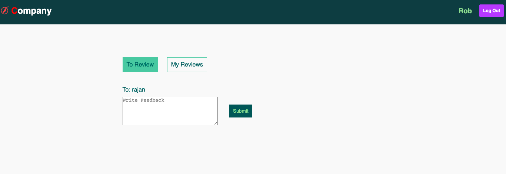

# Employee Review System

## Description

An app where admin and employees are handled seperately, Admin has the priviledge to add/delete/update the
employee and also assign task to an employee to perform in some other employee's performance (give feedback).
Employee on the other can only submit feedback for an employee to whom the task has been assigned for by the admin.

## Features

### Admin View

1. View/Add/Delete/Update/ an Employee
2. View/delete/Assign task to an Employee

### Employee View

1. Submit feedback for other employee's performance
2. View his/her own feedback

## ScreenShot

## Admin view

### view-employess

### Add-employess

### update-employess

### assign-task

### view-task

### view-reviews

## Employee view

### employee-view

### my-reviews

## How to install and run in your local machine

clone the repository by git clone https://github.com/rks1995/employee-review-system.git
cd employee-review-system
run npm install & npm start

### admin login(very important❕)

`email: ratna@gmail.com password: 1234`

## Folder structure

1. assets -> contains all css/js/img file
2. controllers
3. db -> connecting to mongo db
4. middleware
5. models
6. routes
7. views -> all partials are also present
8. app.js
9. package.json
